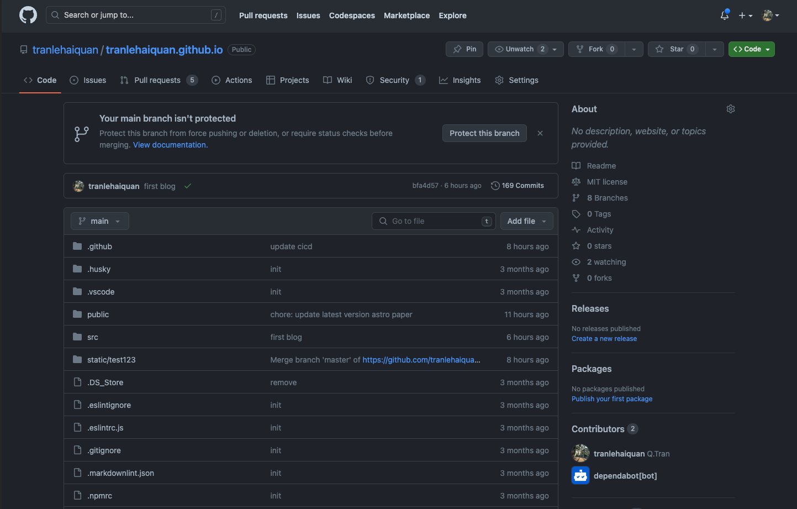
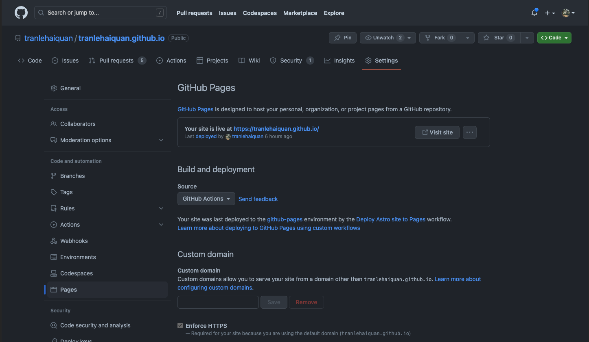
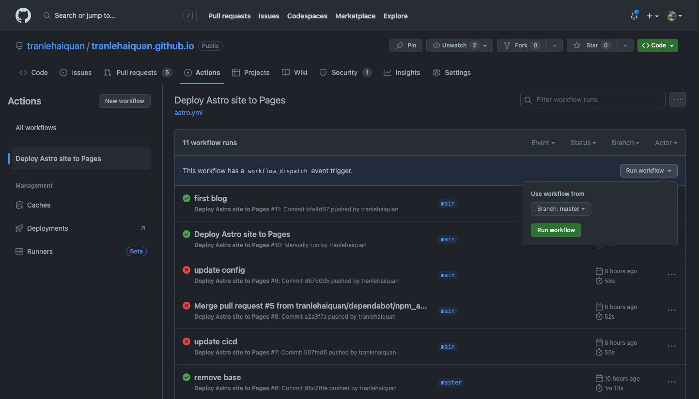
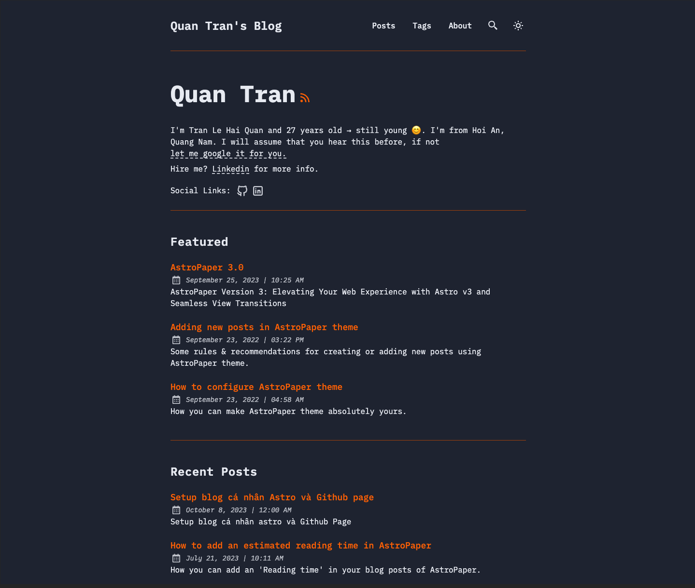

Trang này hiện tại đang được build với Astro v3 và deploy lên trên Github Page. Bài viết này là hướng dẫn và cũng là note cho mình về cách setup một trang Github Page với Astro, mong nó sẽ ít nhiều giúp ích các bạn hoặc để gợi ý lại mình sau này.

## Table of contents

## Chuẩn bị

- Cài đặt Node LTS (hiện tại 18) (https://nodejs.org/en/download)
- Github account (https://github.com/join) -> Github profile ví dụ như của mình **tranlehaiquan**

## Bắt đầu

Mình sẽ dùng Astro template [astro-paper](https://github.com/satnaing/astro-paper) , vào repo astro-paper dùng template


Tên repo mới phải dùng với định dạng <github_account>.github.io (vd: tranlehaiquan.github.io).


## Bật Github Page và dùng Github Actions để deploy

Chúng ta sẽ host blog dùng Github Page và thông qua Github Action. Đầu tiên phải bật phần github page ở repo -> Setting -> Pages -> Build and deployment -> Source chọn Github Actions.



Sau đó tạo 1 file Actions:

```yml
# Sample workflow for building and deploying an Astro site to GitHub Pages
#
# To get started with Astro see: https://docs.astro.build/en/getting-started/
#
name: Deploy Astro site to Pages

on:
  # Runs on pushes targeting the default branch
  push:
    branches: ["master"]

  # Allows you to run this workflow manually from the Actions tab
  workflow_dispatch:

# Sets permissions of the GITHUB_TOKEN to allow deployment to GitHub Pages
permissions:
  contents: read
  pages: write
  id-token: write

# Allow only one concurrent deployment, skipping runs queued between the run in-progress and latest queued.
# However, do NOT cancel in-progress runs as we want to allow these production deployments to complete.
concurrency:
  group: "pages"
  cancel-in-progress: false

env:
  BUILD_PATH: "." # default value when not using subfolders
  # BUILD_PATH: subfolder

jobs:
  build:
    name: Build
    runs-on: ubuntu-latest
    steps:
      - name: Checkout
        uses: actions/checkout@v3
      - uses: pnpm/action-setup@v2
        with:
          version: 8
      - name: Setup Pages
        id: pages
        uses: actions/configure-pages@v3
      - name: Install dependencies
        run: pnpm install
        working-directory: ${{ env.BUILD_PATH }}
      - name: Build with Astro
        run: |
          pnpm run build
        working-directory: ${{ env.BUILD_PATH }}
      - name: Upload artifact
        uses: actions/upload-pages-artifact@v2
        with:
          path: ${{ env.BUILD_PATH }}/dist

  deploy:
    environment:
      name: github-pages
      url: ${{ steps.deployment.outputs.page_url }}
    needs: build
    runs-on: ubuntu-latest
    name: Deploy
    steps:
      - name: Deploy to GitHub Pages
        id: deployment
        uses: actions/deploy-pages@v2
```

Giải thích về Github Action bao gồm 2 jobs:

- Job tên là Build đầu tiên sẽ thực hiện việc build blog
- Job tên là deploy thứ 2 sẽ thực hiện phần deploy blog lên Github Page

Sau khi lưu xong file, vào phần Actions -> Deploy Astro site to Pages -> Run workflow



## Cuối cùng


