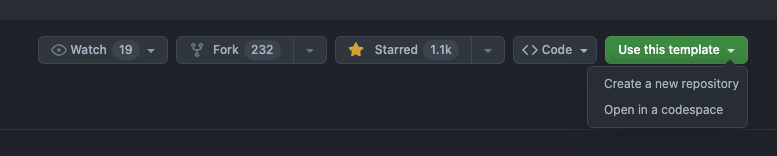

Trang này hiện tại đang được build với Astro v3 và deploy lên trên Github Page. Bài viết này là hướng dẫn và cũng là note cho mình về cách setup một trang Github Page với Astro, mong nó sẽ ít nhiều giúp ích các bạn hoặc để gợi ý lại mình sau này.

## Table of contents

## Chuẩn bị

- Cài đặt Node LTS (hiện tại 18) (https://nodejs.org/en/download)
- Github account (https://github.com/join) -> Github profile ví dụ như của mình **tranlehaiquan**

## Bắt đầu

Mình sẽ dùng Astro template [astro-paper](https://github.com/satnaing/astro-paper) , vào repo astro-paper dùng template

Tên repo mới phải dùng với định dạng <github_account>.github.io (vd: tranlehaiquan.github.io).

## Tùy chỉnh, update lại blog

Sau khi tạo xong repo, chúng ta tiến hành clone repo về chạy local và thử build.

## Bật Github Page và dùng Github Actions để deploy

## Thành phẩm
